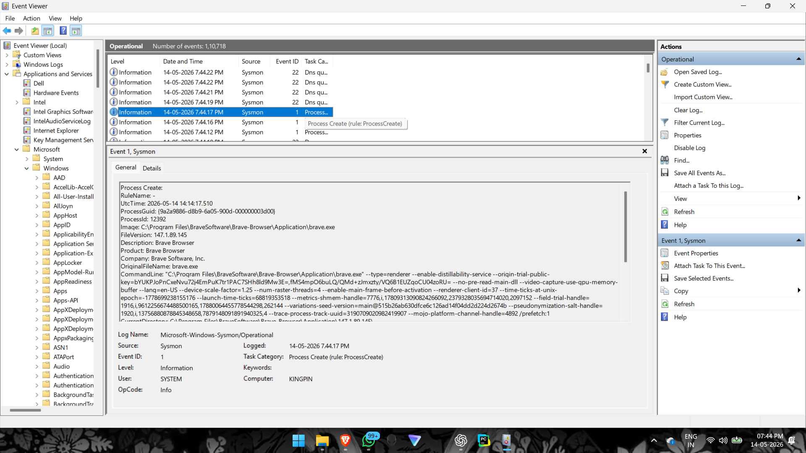
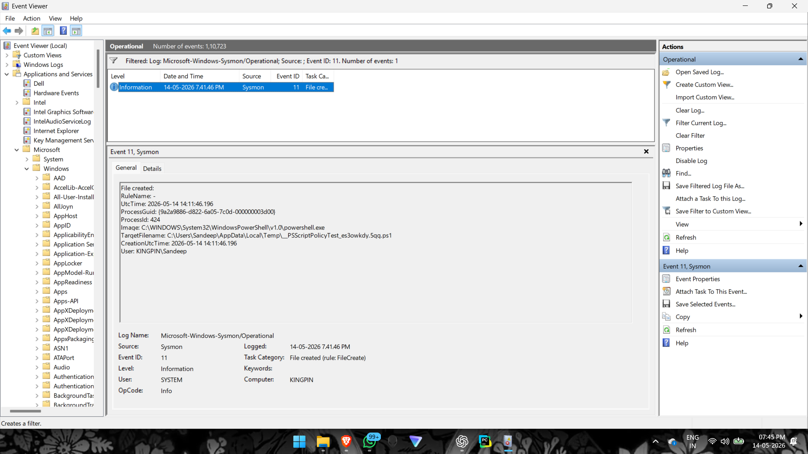
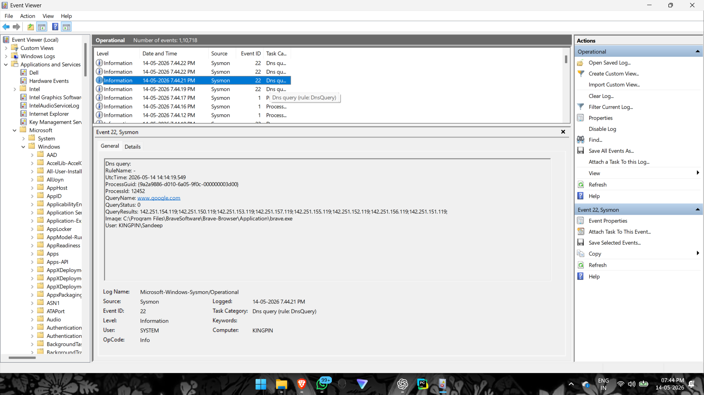

# Sysmon Endpoint Security Monitoring

## Overview
This project demonstrates endpoint monitoring and threat detection using Sysmon on Windows systems. The project focuses on analyzing endpoint telemetry, process activity and network connections for security investigations.

---

## Objectives
- Monitor endpoint activity
- Detect suspicious processes
- Analyze network connections
- Investigate PowerShell activity
- Improve endpoint visibility

---

## Tools Used
- Sysmon
- Windows Event Viewer
- PowerShell
- Command Prompt
- Windows OS

---

## Key Event IDs Monitored

| Event ID | Description |

| 1 | Process Creation |
| 3 | Network Connection |
| 5 | Process Termination |

---

## Activities Performed
- Installed and configured Sysmon
- Monitored endpoint telemetry
- Investigated process creation events
- Generated network activity
- Analyzed PowerShell execution
- Collected endpoint logs

---

## Screenshots

### Process Creation Event

---

### PowerShell Activity

---

### Network Connection Event

---

## Skills Learned
- Endpoint Monitoring
- Windows Event Analysis
- Threat Detection
- Process Investigation
- Security Log Analysis
- SOC Workflow Fundamentals

---

## MITRE ATT&CK Mapping

| Technique | Description |

| T1059 | Command and Scripting Interpreter |
| T1049 | System Network Connections Discovery |
| T1105 | Ingress Tool Transfer |

---

## Future Improvements
- Integrate with Splunk
- Create automated alerts
- Add Sigma detection rules
- Forward logs to SIEM platforms
